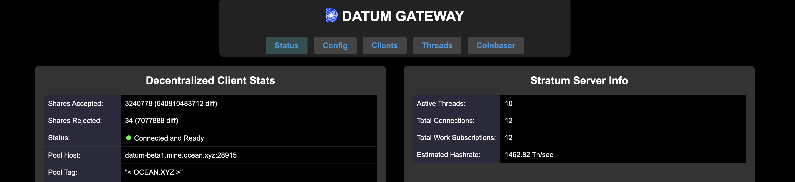

---

## Table of Contents

- [Overview](#overview)
- [Prerequisites](#prerequisites)
- [Windows](#windows)
  - [Installing WSL](#installing WSL)
  - [Configuring Your Windows Machine](#configuring-your-windows-machine)
- [Using Windows App](#using-windows-app)
  - [Connecting to Your Windows Machine](#connecting-to-your-windows-machine)
  - [Adjusting Display Settings](#adjusting-display-settings)
    - [Changing Resolution](#changing-resolution)
    - [Using Windows Magnifier](#using-windows-magnifier)
    - [Scaling in Windows](#scaling-in-windows)
- [Troubleshooting](#troubleshooting)
  - [Common Issues](#common-issues)
  - [Display Too Small](#display-too-small)
- [Tips and Tricks](#tips-and-tricks)
- [Resources](#resources)

---

## Overview

Get DATUM running in various different setups!

---

## Prerequisites

If running X machines - need Y powerful machine
If running Z machines - need A powerful machine

---

## Windows

[windows-0](windows-0.png)

### Installing WSL

1. Open up a Terminal [terminal](images/terminal.png).
2. Install WSL with `wsl --install` [wsl-1](images/wsl-1.png).
3. Hit "Yes" [yes-1.png](/images/yes-1.png).

### Configuring Your Windows Machine

1. On your Windows PC, go to `Settings > System > Remote Desktop`.
2. Enable **Remote Desktop** and note the PC name.
3. Allow access for your user account.

---

## Using Windows App

### Connecting to Your Windows Machine

1. Open Windows App on your Mac.
2. Click **Add PC**.
3. Enter the PC name or IP address, then add credentials.
4. Double-click the connection to start.

### Adjusting Display Settings

If everything looks tiny, adjust the display with these methods.

#### Changing Resolution

1. In Windows App, select your connection and click **Edit**.
2. Go to the **Display** tab.
3. Choose a lower resolution (e.g., 1920x1080) from the dropdown.
4. Save and reconnect.

#### Using Windows Magnifier

1. On the remote Windows machine, press `Windows key + Plus (+)` to open Magnifier.
2. Zoom in with `Windows key + Plus (+)` or out with `Windows key + Minus (-)`.

#### Scaling in Windows

1. On the Windows machine, go to `Settings > System > Display`.
2. Under **Scale and layout**, set scaling to 125% or higher.
3. Sign out and reconnect for changes to take effect.

---

## Troubleshooting

### Common Issues

| Issue                     | Solution                                                                 |
|---------------------------|--------------------------------------------------------------------------|
| Connection fails          | Check network, verify PC name/IP, ensure Remote Desktop is enabled.      |
| Display too small         | Adjust resolution or scaling (see [Adjusting Display Settings](#adjusting-display-settings)). |

### Display Too Small

If the display is still tiny:
- Ensure **Optimize for Retina displays** is checked in Windows App settings.
- Try a custom resolution in Preferences > Resolutions (e.g., 1600x900).

---

## Tips and Tricks

- **Keyboard Shortcuts**: Use `Ctrl + Shift + Esc` to open Task Manager remotely.
- **Clipboard Sharing**: Copy/paste text between Mac and Windows seamlessly.
- **Multi-Monitor**: Enable multiple displays in the **Display** tab if your Windows PC supports it.

---

## Resources

- [Official Windows App Documentation](https://learn.microsoft.com/en-us/windows-server/remote/remote-desktop-services/clients/remote-desktop-mac)
- [Windows Remote Desktop Support](https://support.microsoft.com/en-us/windows)
- [GitHub Issues](https://github.com/your-repo/issues) for community help.

---

*Last updated: April 2025*
